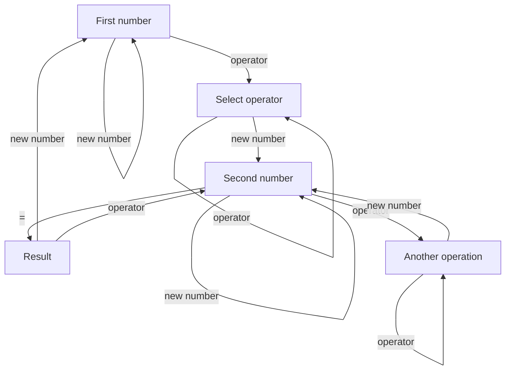

# The PWA Vue Calculator

The yet another calculator.

The project is based on [Vue](https://vuejs.org/). It is my first approach to this framework. It's also my first approach to [Progressive Web Application](https://en.wikipedia.org/wiki/Progressive_web_application).

## Calculator

I wish to create the web version of _classic_ electornic calculator.
I also build this application on request of very excentric person, therefor strange buttons layout.

### Calculator state machine

The calculator is based on state machine. The inputs for states are: `new number` (which mean that new digit or coma button has been pressed), the `operator` (which mean that operation button has been pressed) and the `equal` (the confirm calculation button).

The forming number itself is handled outside: to the state machine only whole already parsed number is provided. Button `clear` just setting up whole machine on the begining.



## Vue

### Project setup

```bash
npm install
```

### Compiles and hot-reloads for development

```bash
npm run serve
```

### Compiles and minifies for production

```bash
npm run build
```

### Lints and fixes files

```bash
npm run lint
```

### Customize configuration

See [Configuration Reference](https://cli.vuejs.org/config/).
